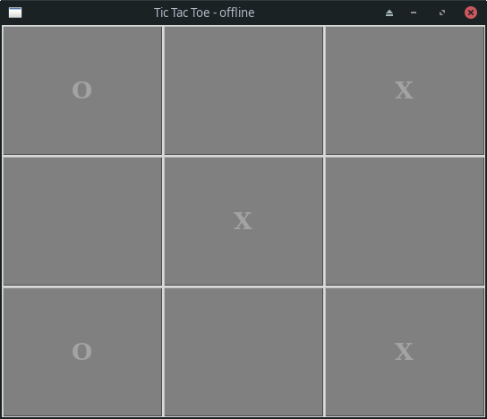

# Tic Tac Toe
[Tic Tac Toe](https://en.wikipedia.org/wiki/Tic-tac-toe) game written on python and tkinter with online and offline version

<div style="text-align:center"></div>


## Requirements
[Tkinter](https://docs.python.org/3/library/tkinter.html) comes pre-installed with the Python installer binaries for Mac OS X and the Windows platform. So if you install Python from the official binaries for Mac OS X or Windows platform, you are good to go with Tkinter. **But for linux** you have to install it manually.

## Usage

### Clone repo
```
git clone https://github.com/AmirAhrari/tic-tac-toe
cd tic-tac-toe
```

### Offline
```
python offline/main.py
```

### Online
Run this on your server
```
python online/server.py
```

Run this on clients
```
python online/main.py
```
#### Note: you should set your server ip address in  [online/lib/client.py](online/lib/client.py) if its not in your localhost
